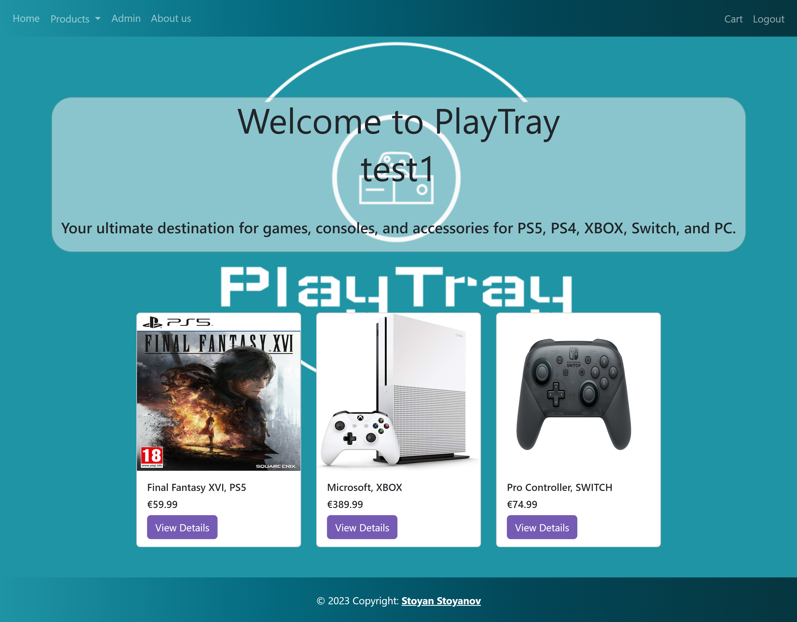
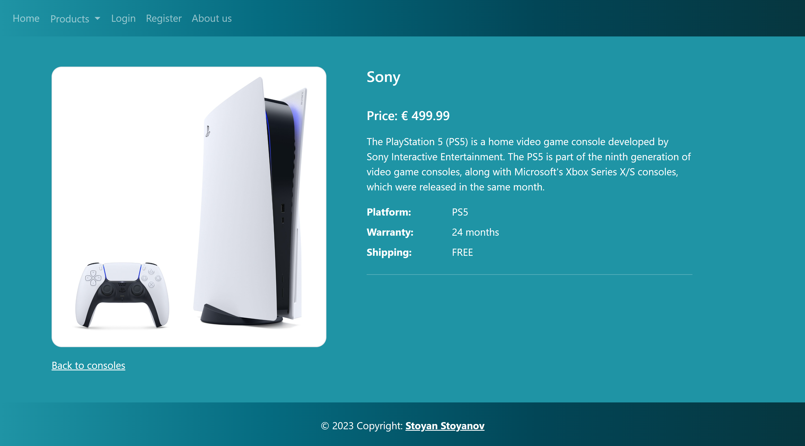
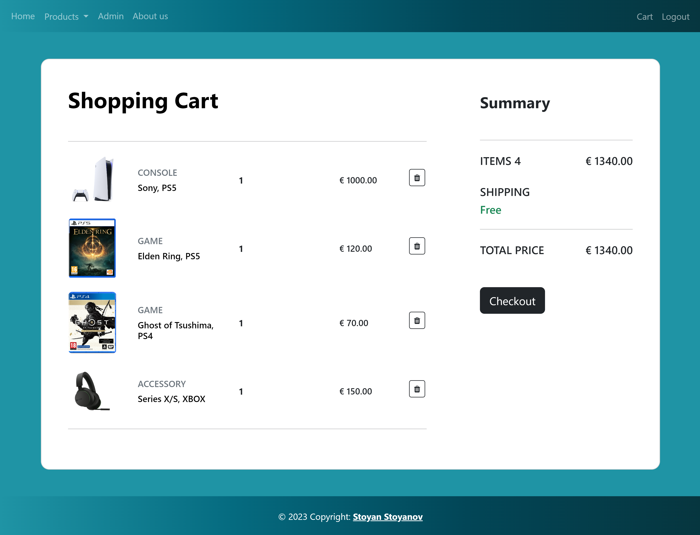
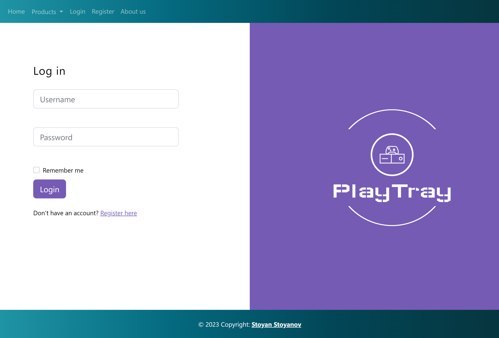

# 🎮 OnlineGameShop

Welcome to **OnlineGameShop**, a mock online store for purchasing video games. This project serves as a foundation for a digital marketplace, simulating the core functionalities needed in a game e-commerce platform, such as catalog browsing, user registration, and checkout processes.

## 🛠 Features

- **Browse Games** - View a selection of games, complete with descriptions, prices, and ratings.
- **User Authentication** - Register and log in as a user to save purchase history and access personalized content.
- **Shopping Cart** - Add games to a cart and review before purchasing.
- **Order Processing** - Complete orders with a simple checkout flow.
- **Admin Dashboard** - Manage products, users, and orders through an admin panel.
  
This project is built to help developers understand the basic structure of an e-commerce site while practicing with Java and web application development.

## 📸 Screenshots









## 🚀 Getting Started

Follow these instructions to get the project up and running on your local machine in IntelliJ IDEA for development and testing.

### Prerequisites

To run this project, you'll need the following installed:

- **Java** (JDK 8 or higher)
- **IntelliJ IDEA** (Community or Ultimate Edition)
- **Maven** (IntelliJ will handle Maven dependencies automatically if configured)
- **MySQL** (or another database of your choice)

### Installation

1. **Clone the repository**

   ```bash
   git clone https://github.com/100yan-100yanov/OnlineGameShop.git
   ```

2. **Open the Project in IntelliJ IDEA**

   - Open IntelliJ IDEA.
   - Go to `File > Open...` and select the `OnlineGameShop` directory.
   - IntelliJ should automatically detect and import the Maven project structure.

3. **Configure the Database**

   - Create a new database in MySQL (or your chosen database).
   - Update the database connection settings in `src/main/resources/application.properties` with your database credentials.

4. **Build the Project**

   - Go to `View > Tool Windows > Maven` to open the Maven window.
   - In the Maven window, select `Lifecycle > clean` and then `Lifecycle > install` to build the project and download dependencies.

5. **Run the Application**

   - Locate the `OnlineGameShopApplication.java` file in `src/main/java/com/example/onlinegameshop`.
   - Right-click the file and select `Run 'OnlineGameShopApplication'`.
   - The server should start, and you can access the site at `http://localhost:8080/`.

### Configuration

To customize the app's behavior, edit the settings in the `application.properties` file located in the `src/main/resources` directory.

## 📚 Usage

1. **Admin Panel**

   To access the admin panel, log in using the credentials set in the application. From here, you can manage games, users, and orders.

2. **Shop Interface**

   As a regular user, you can:
   - Browse games
   - Add items to your cart
   - Complete purchases

   As an admin, you have additional options to manage content directly from the admin panel.

## 📂 Project Structure

```plaintext
OnlineGameShop/
├── src/
│   ├── main/
│   │   ├── java/
│   │   │   └── com/
│   │   │       └── example/
│   │   │           └── onlinegameshop/
│   │   │               ├── OnlineGameShopApplication.java  # Main application class
│   │   │               ├── controller/                     # Controllers for handling requests
│   │   │               ├── model/                          # Models for database entities
│   │   │               ├── repository/                     # Interfaces for database access
│   │   │               └── service/                        # Business logic
│   │   └── resources/
│   │       ├── application.properties                      # Configuration properties
│   │       └── static/                                     # Static assets (CSS, JS)
├── pom.xml                                                  # Maven configuration file
└── README.md                                                # Project documentation
```

## 🧪 Testing

To run tests for the project, go to the `src/test/java` directory. Right-click on the test files or folders and select **Run 'Tests in...'** to execute all tests.

Alternatively, you can use Maven to run tests:

```bash
mvn test
```

## 🤝 Contributing

Contributions are welcome! To contribute:

1. **Fork the repository**
2. **Create a new branch** (`git checkout -b feature-name`)
3. **Make changes and commit** (`git commit -m 'Add a feature'`)
4. **Push to the branch** (`git push origin feature-name`)
5. **Open a Pull Request**

For major changes, please open an issue first to discuss what you would like to change.

## 🐛 Reporting Issues

Found a bug? Please open an [issue](https://github.com/100yan-100yanov/OnlineGameShop/issues) and describe the problem in detail.

## 📄 License

This project is licensed under the MIT License. See the [LICENSE](LICENSE) file for details.

---

**Happy coding! 🎉**

---
